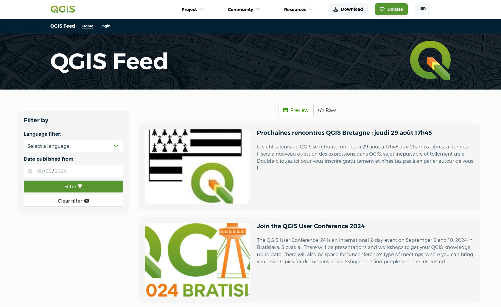
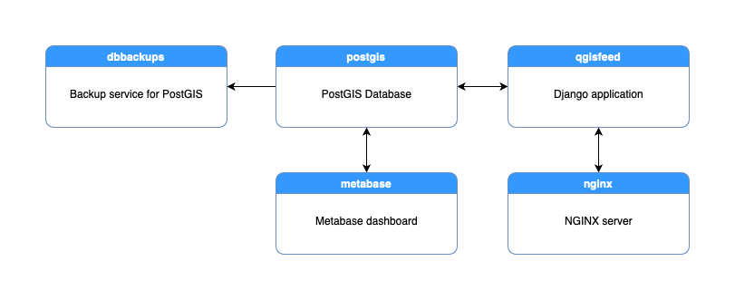

[](https://circleci.com/gh/elpaso/qgis-feed)

# QGIS Home Page News Feed

This application is the backend part that manages and serves news for the QGIS welcome page.



## Tech stack



This application is based on Django, written in Python and deployed on the server using
docker-compose.

## Installation Guide
<details>
    <summary><strong>Development Environment Installation</strong></summary>
    </br>

For development purposes only, you can run this application in debug mode with docker compose. Some of the docker compose commands are already configured in the Makefile.

- Build the docker the container
```bash
$ make dev-build
```

- Create `settings_local.py` int the `qgisfeedproject` directory, configure the email sender variables and DB configuration as in the example below:

```python
# The db service in the docker-compose is used by default
# You can specify the databse with the configuration below
DATABASES = {
    'default': {
        'ENGINE': 'django.contrib.gis.db.backends.postgis',
        'NAME': 'qgisfeed',
        'USER': 'your_username',
        'PASSWORD': 'your_password',
        'HOST': 'localhost',
        'PORT': '5432'
    }
}
```

- Generate the `.env` from `env.template` and edit it with your email variables:
```sh
cp env.template .env
nano .env
```

See https://docs.djangoproject.com/en/2.2/topics/email/#module-django.core.mail for further email configuration.

- To prevent DDOS attacks there is limit in the number of returned records (defaults to 20): it can be configured by overriding the settings in `settings_local.py` with:

```python
QGISFEED_MAX_RECORDS=40  # default value is 20
```

- Start the docker the container
```bash
$ make dev-start
```

- Run migrations:
```bash
$ make dev-migrate
```

- Create an admin user and set a password:
```bash
$ make dev-createsuperuser
```

- Show the development server logs:
```bash
$ make dev-logs
```


A set of test data will be automatically loaded and the application will be available at http://localhost:8000

To enter the control panel http://localhost:8000/admin, two test users are available:

- Super Admin: the credentials are `admin`/`admin`
- Staff (News Entry Author): the credentials are `staff`/`staff`

</details>

<details>
    <summary><strong>Production Environment Installation</strong></summary>
    </br>
For production, you can run this application with make commands or docker compose:

Docker configuration should be present in `.env` file in the main directory,
an example is provided in `env.template`:

```bash
# This file can be used as a template for .env
# The values in this file are also the default values.

# Host machine persistent storage directory, this path
# must be an existent directory with r/w permissions for
# the users from the Docker containers.
QGISFEED_DOCKER_SHARED_VOLUME=/shared-volume

# Number of Gunicorn workers (usually: number of cores * 2 + 1)
QGISFEED_GUNICORN_WORKERS=4

# Database name
QGISFEED_DOCKER_DBNAME=qgisfeed
# Database user
QGISFEED_DOCKER_DBUSER=docker
# Database password
QGISFEED_DOCKER_DBPASSWORD=docker
```

```bash
$ make start
```

A set of test data will be automatically loaded and the application will be available at http://localhost:80

To enter the control panel http://localhost:80/admin, two test users are available:

- Super Admin: the credentials are `admin`/`admin`
- Staff (News Entry Author): the credentials are `staff`/`staff`

### Enable SSL Certificate on production using Docker

1. Generate key using openssl in dhparam directory
```bash
openssl dhparam -out /home/web/qgis-feed/dhparam/dhparam-2048.pem 2048
```

2. Run the container
```bash
$ make start
```

3. Update `config/nginx/qgisfeed.conf` to include the new config file in `config/nginx/ssl/qgisfeed.conf`
```
include conf.d/ssl/*.conf;
```

4. Restart nginx service
```
nginx -s reload
```

5. To enable a cronjob to automatically renew ssl cert, add `scripts/renew_ssl.sh` to crontab file.

</details>

## User guide

<details>
    <summary><strong>Home page</strong></summary>
    </br>

A home page that displays feeds as they are rendered in QGIS is now available at the root of the web server `/`. Feeds are filterable using the filter widget on the left side. You can directly pass the filter parameters in the url according to the section **Available parameters for filters** in **Endpoint and accepted parameters**

***Note: When calling the root url from QGIS, the response data is in JSON format. See the section Response data for QGIS in the Endpoint and accepted parameters***
</details>

<details>
    <summary><strong>Control panel and permissions</strong></summary>
    </br>

Users with `staff` flag can enter the control panel at `/admin` and add feed entries, by default entries are not published.

Users with `superadmin` flag will be notified by email when an entry is added to the feed and will be able to publish the entry.

Appart from `superadmin`, only users with the permission `qgisfeed | Can publish QGIS feed` can publish the entry. Like the group `qgisfeedentry_authors`, the group `qgisfeedentry_approver` with the permission `qgisfeed | Can publish QGIS feed` are created when a `Save` signal from the `User` model is detected.

For content field, a hard limit on the number of characters allowed is configurable in administration page (Character limit configurations). If not set, max characters value for this field is 500. If you want to add a custom max characters for this field, the field name value should be `content`.
</details>

<details>
    <summary><strong>Manage feeds page</strong></summary>
    </br>

***Note: The permissions for this page are the same as described in the Control Panel and permissions.***

After logging in with the login screen at `/accounts/login/` (can be also accessed from the **Login** button on the **Homepage**), users are provided with tools to manage feed items:
- A list of feed items, sortable and filterable by title, date published, author, language, need review
- A button to create a new feed item - clicking will take you to a blank feed item form (See **Feed item form** below)
- Clicking on an item on the list will take you to a feed item form (See **Feed item form** below)

</details>


<details>
    <summary><strong>Feed item form</strong></summary>
    </br>

The feed item form page is displayed when clicking the **New feed** item button or an item on the list:
- The feed item form is displayed on the left with all the widgets needed to edit the entry. On the right, a preview of the entry as it will be rendered in QGIS. Any edits made in the form shall immediately update the preview.
- In the content widget only the following html tags are allowed: p, strong, italics. A hard limit on the number of characters allowed is configurable in administration page in the model `Character limit configurations`.
- Once a feed item is created or modified, there will be a review step where the user is asked to confirm that they have checked everything carefully.
- The form is placed in the column **Need review** in the list before final submission.
- The form must be approved by someone the permission `qgisfeed | Can publish QGIS feed` before it is published.

</details>

<details>
    <summary><strong>Endpoint and accepted parameters</strong></summary>
    </br>

### Response data for QGIS
The application has a single endpoint available at the web server root `/` the reponse is in JSON format.

Example call: http://localhost:8000/

Returned data:
```json
[
  {
    "pk": 1,
    "title": "QGIS acquired by ESRI",
    "image": "http://localhost:8000/media/feedimages/image.png",
    "content": "<p>QGIS is finally part of the ESRI ecosystem, it has been rebranded as CrashGIS to better integrate with ESRI products line.</p>",
    "url": "https://www.qgis.com",
    "sticky": true,
    "publish_from": 1557419128
  },
  {
    "pk": 2,
    "title": "Null Island QGIS Meeting",
    "image": "",
    "content": "<p>Let's dive in the ocean together!</p>",
    "url": null,
    "sticky": false,
    "publish_from": 1557419128
  },
  {
    "pk": 3,
    "title": "QGIS Italian Meeting",
    "image": "",
    "content": "<p>Ciao from Italy!</p>",
    "url": null,
    "sticky": false,
    "publish_from": 1557419128
  }
]
```

### Available parameters for filters

The following parameters can be passed by the client to filter available records.

Parameters are validated and in case they are not valid a `Bad Request` HTTP error code `400` is returned.

#### after

When `after` is passed, only the records that have been published after the given value will be returned.

Accepted values: unix timestamp (UTC)

Example call: http://localhost:8000/?after=1557419013


#### lang

When `lang` is passed, the records that have a different `lang` will be excluded from the results. Only the records with `null` `lang` and the records with a matching `lang` will be returned.

Accepted values: `ISO-939-1` two letters language code

Example call: http://localhost:8000/?lang=de

#### lat lon (location)

When `lat` **and** `lon` are passed, the records that have a location filter set will be returned only if the point defined by `lat` and `lon` is within record's location.

Accepted values: `ESPG:4326` latitude and longitude

Example call: http://localhost:8000/?lat=44.5&lon=9.23
</details>

## Runing tests
<details>
    <summary><strong>Run all tests</strong></summary>
    </br>

To run all tests cases in the qgisfeed app, from the main directory:
```sh
$ make dev-runtests
```
</details>

<details>
    <summary><strong>Run each test</strong></summary>
    </br>

To run each test case class in the qgisfeed app:
```sh
$ docker-compose -f docker-compose.dev.yml exec qgisfeed python qgisfeedproject/manage.py test qgisfeed.tests.QgisFeedEntryTestCase
$ docker-compose -f docker-compose.dev.yml exec qgisfeed python qgisfeedproject/manage.py test qgisfeed.tests.QgisUserVisitTestCase
$ docker-compose -f docker-compose.dev.yml exec qgisfeed python qgisfeedproject/manage.py test qgisfeed.tests.HomePageTestCase
$ docker-compose -f docker-compose.dev.yml exec qgisfeed python qgisfeedproject/manage.py test qgisfeed.tests.LoginTestCase
$ docker-compose -f docker-compose.dev.yml exec qgisfeed python qgisfeedproject/manage.py test qgisfeed.tests.FeedsItemFormTestCase
$ docker-compose -f docker-compose.dev.yml exec qgisfeed python qgisfeedproject/manage.py test qgisfeed.tests.FeedsListViewTestCase
```
</details>


## Deployment

<details>
    <summary><strong>Email-sending setup</strong></summary>
    </br>


- Generate the `.env` from `env.template` and edit it with the production email variables:
```sh
cp env.template .env
nano .env
```

</details>

<details>
    <summary><strong>Troubleshooting SSL in production</strong></summary>
    </br>

Sometimes it seems our cron does not refresh the certificate. We can fix like this:

**Gentle Way**

```
ssh feed.qgis.org
cd /home/web/qgis-feed
scripts/renew_ssl.sh
```

Now check if your browser is showing the site opening with no SSL errors: https://feed.qgis.org

**More crude way**

```
ssh feed.qgis.org
cd /home/web/qgis-feed
make start c=certbot
make restart c=nginx
```

Now check if your browser is showing the site opening with no SSL errors: https://feed.qgis.org

</details>

Please visit the private Sysadmin documentation for more details about the deployment of https://feed.qgis.org


## Backups

If something goes terribly wrong, we keep 7 nights of backups on hetzner and daily backups on a storage box.

If those are also not useful there are a collection of snapshot backups on hetzner and on a storage box

Last resort: Tim makes backups to his local machine on a semi-regular basis.
